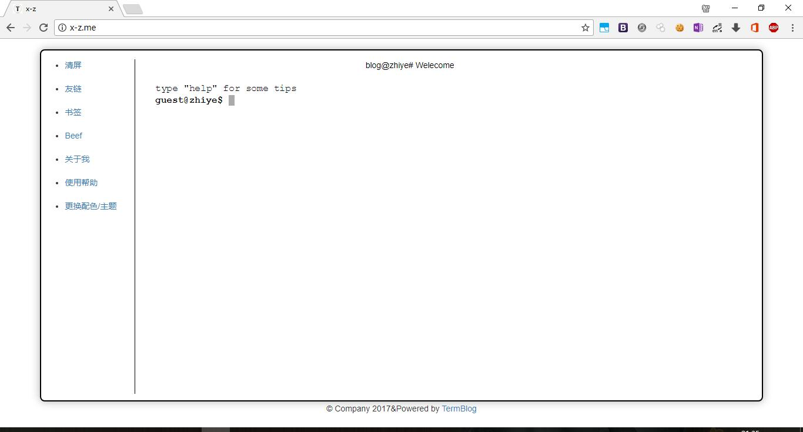
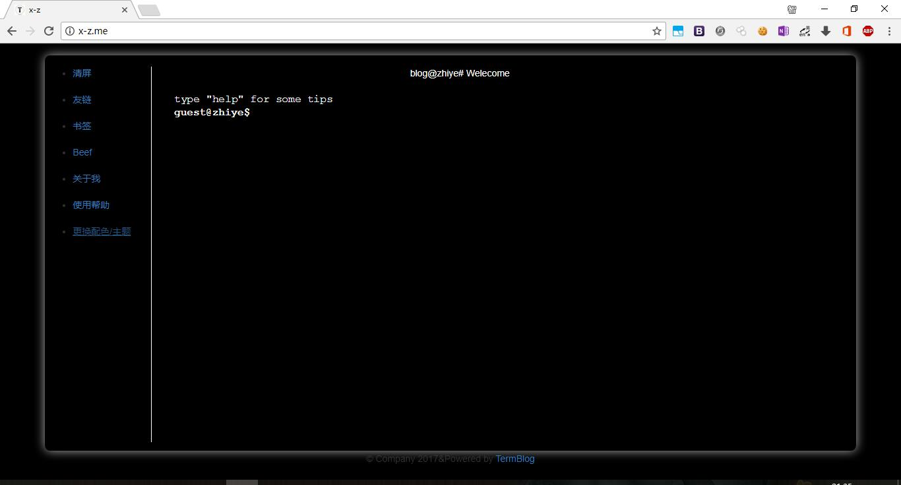

## TermBlog

一个对搜索引擎极不友好的博客。  
基于express，简洁干净，无数据库。  
白色主题  
  
黑色主题  


### 部署

#### 安装及运行

```bash
git clone https://github.com/youzhiye/TermBlog.git
cd TermBlog
npm install --save 
node index.js or npm start
```  

##### 发布文章

只需将md文档放到posts目录中即可.

*注：当前版本为开发体验版本，更多的细节及体验正在优化中。。。*  
##### 导航栏操作

当前版本只能自己看源码实现。只需修改index.html里边对应的js函数即可自己定制导航栏  

##### 路由文件

因为上个版本路由文件已经模块化，所以可自行向routes文件夹内添加功能模块让博客更个性化（后续一些自用功能模块不打算开源）。  

### ChangeLog

#### 当前版本0.1.0

* 改进README.MD，增加描述
* 导航栏功能全部可用，（主要是让自己用着更舒服了==）  

#### 当前版本0.0.2  

* 多项细节优化  
* 路由文件模块化  
* 添加注释，增加代码可读性

#### V0.0.1  

* 完善了博客的基础功能    
* 简洁的ui  
* 四套主题颜色  

### To-do  

* 添加评论功能。  
* 更多的细节优化。 
* 添加一些命令行自带的实用功能。  
* 更加便捷的部署方式和代码同步方式。 

### 感谢  
> 本博客系统各种前端jq库的开发者，以及[放放酱](https://godeep.pro)的体验反馈  
> 给本项目点star的你