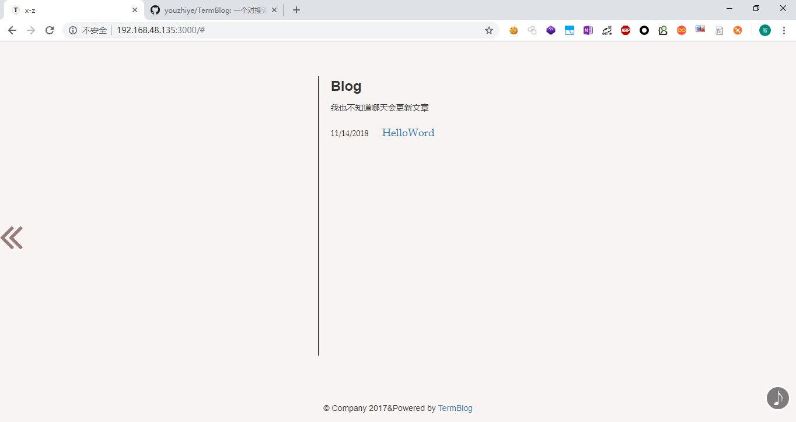

## TermBlog

> 一个对搜索引擎极不友好的博客系统。~~(将在2.0.0版本中增加对搜索引擎的友好度)~~  
> 基于express，炫酷简洁干净，无数据库。  

>> 首页
  
>> 白色主题  
  
>> 黑色主题  
  

### 部署

#### 安装及运行

```bash
git clone https://github.com/youzhiye/TermBlog.git
cd TermBlog
npm install --save 
node index.js //or npm start
```  

#### 发布文章

只需将md文档放到posts目录中即可.系统会在运行后自动生成静态html文件（见index.js 65-68行）

*注：当前版本为开发体验版本，更多的细节及体验正在优化中。。。*  

#### 导航栏操作

当前版本只能自己看源码实现。修改index.ejs里边对应的js函数即可自己定制导航栏  

#### 路由文件

因为上个版本路由文件已经模块化，所以可自行向routes文件夹内添加功能模块让博客更个性化。  

### ChangeLog  

#### 当前版本1.2.1

* 移除比赛题目设定的相关代码

#### 1.2.0  

* ~~插件功能支持es7语法，解决无返回值的问题~~  
* ~~插件文件整合到moudle文件夹下~~  
* ~~插件不会一直处于导入状态，执行结束后需重新调用（解决每次修改代码都要重新运行npm start命令的问题）~~  
TODO:  
* 下个版本增加代码的可读性  

#### V1.1.0

* ~~增加base64编码命令，包括对图片的编码~~
* ~~增加高权限认证操作~~
* ~~高权限执行插件功能（不完善）~~  
* ~~修复播放音乐图标无法显示的问题~~  
* ~~删除了些没用的内容~~    
TODO:  
* ~~卸载插件~~

#### V1.0.0

* 优化对搜索引擎的友好程度，增加页面过度动画  

#### V0.1.1  

* 利用trim删除命令首尾空格  
* 修复article.js,cli.js的逻辑问题  
* 一个可能引起安全问题的正则  
* 再次重构规范代码,,更加模块化  
* 添加背景音乐功能  
* 优化添加插件的成本

#### V0.1.0

* 改进README.MD，增加描述
* 导航栏功能全部可用，（主要是让自己用着更舒服了==）  

#### V0.0.2  

* 多项细节优化  
* 路由文件模块化  
* 添加注释，增加代码可读性

#### V0.0.1  

* 完善了博客的基础功能    
* 简洁的ui  
* 四套主题颜色  

### To-do  

* 添加评论功能。  
* 更多的细节优化。 
* 添加一些命令行自带的实用功能。  
* 更加便捷的部署方式和代码同步方式。 
* 写文章写文章写文章。  

## 感谢  
> 本博客系统各种前端jq库的开发者，以及[放放酱](https://godeep.pro)的体验反馈  
> 给本项目点star的你